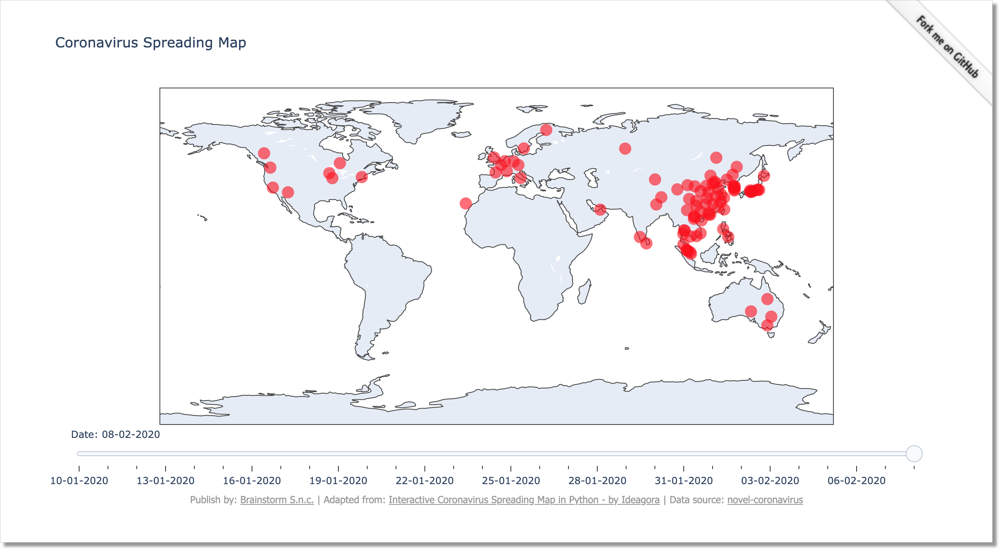

Coronavirus Spreading Map
=========================

Just for fun, I published a single-page site showing the Coronavirus spreading
map, based on the interesting article
[Interactive Coronavirus Spreading Map in Python](https://www.geodose.com/2020/02/tracking-coronavirus-python-map.html) by Ideagora.

The page can be reached at the following address:

[http://coronavirus-spreading-map.brainstorm.it](http://coronavirus-spreading-map.brainstorm.it)

[](http://coronavirus-spreading-map.brainstorm.it)


The site doesn't require any database, nor provides any admin page.

Thanks to it's modularity, it's so easy to use Django as a mini-framework:
just remove unused features from settings.

Local installation
------------------

- build a virtualenv
- install the requirements
- run the development web server

For example (using virtualenvwrapper):

```
    mkvirtualenv coronavirus-spreading-map
    pip install -r requirements/base.txt
    python manage.py runserver
```

then visit http://127.0.0.1:8000/
